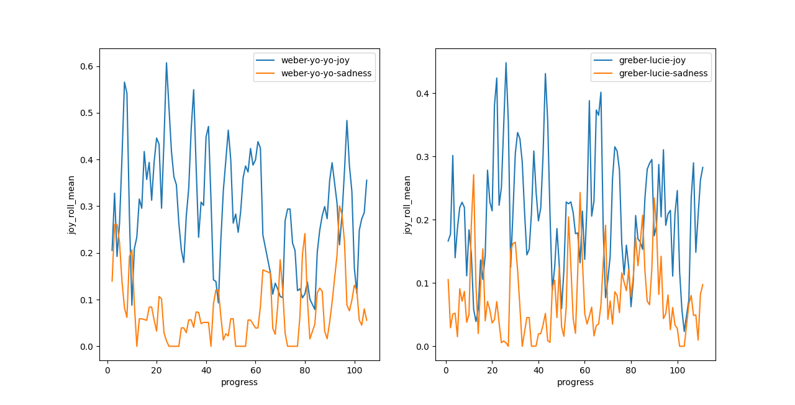
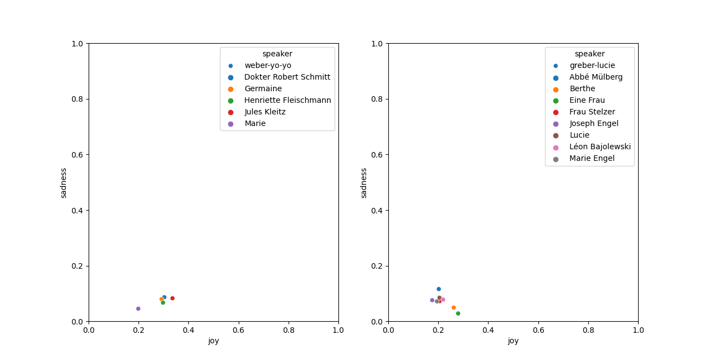
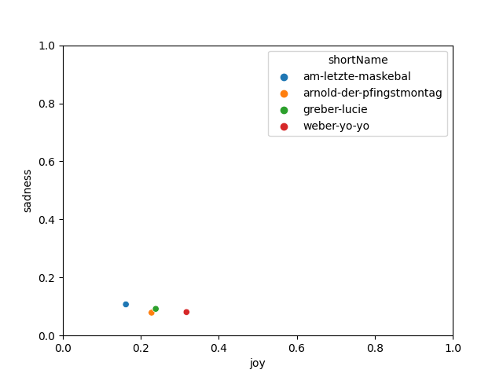
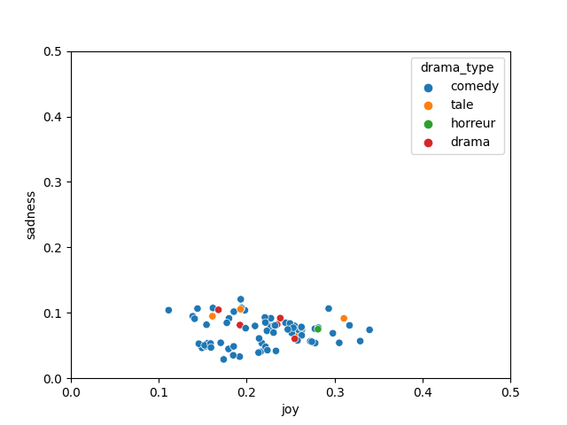
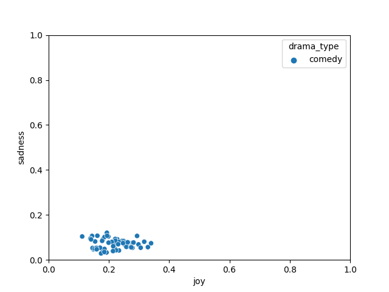
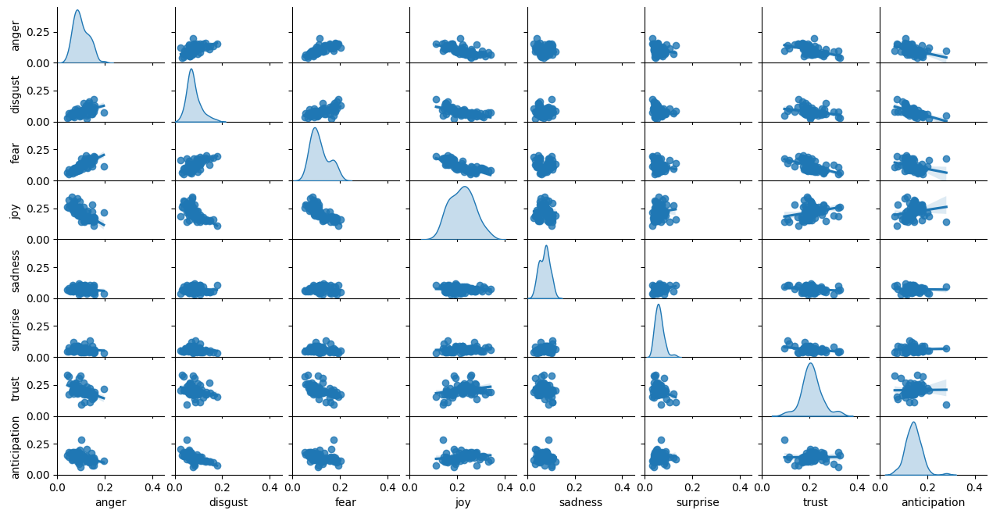
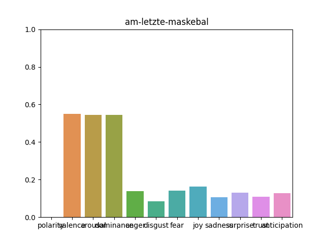
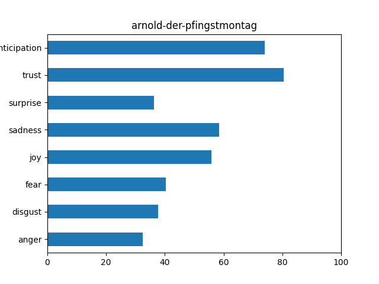
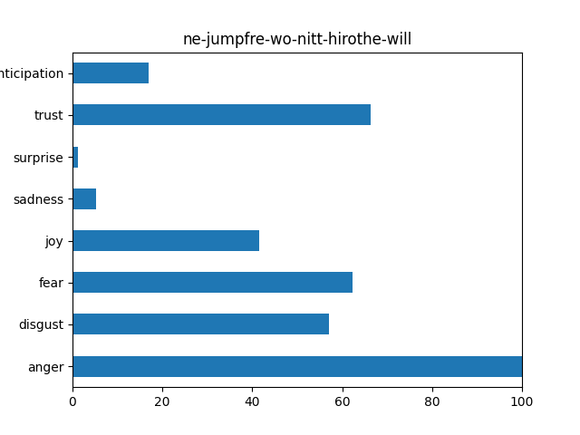

EDYTHA - Emotion Dynamics for Theater in Alsatian
-----------------
[[Version en français]](README-fr.md)

[](https://doi.org/10.5281/zenodo.10578348)

- Sources for Qinyue Liu's internship on the analysis of emotions in Alsatian theater plays.
- Tool for emotion analysis developed by Qinyue Liu.
- Internship supervised by Delphine Bernhard and Pablo Ruiz at the University of Strasbourg (LiLPa UR 1339 as part of the [MeThAl](https://methal.pages.unistra.fr/en) project).


## Repository content

A description of the directories in the repository follows. You can also find a [tutorial](#tutorial) below.

- **emotions**
	- Results of emotion analysis in CSV for each play, along with scripts for analysis and visualization.
	- *avgEmoValues.py*:
	Script written by [EmotionDynamics](https://github.com/Priya22/EmotionDynamics/tree/master/code) to calculate emotion scores based on a lexicon.
	- *alsatian_tokeniser.py*:
	Script to tokenize Alsatian texts, written by D. Bernhard.
	- *pre-graphic.py*:
	Script to calculate rolling means and to group plays' emotions scores, outputting them to file `all_pieces_info.csv`.
	- *split_plays.py*:
	Processing to split plays in chunks of roughly equal size sequentially.
	- *graphic.py*:
	Script to perform emotion analyses and result visualization.
- **graphics**
	- Directory to save visualization results in image format.
  
- **intermediate**
	- *csv_replaced*:
	A directory containing CSV files of plays, where orthographic variants in Alsatian have been replaced by a standard form.
	- *idf_info*:
	A directory containing, for each play, the IDF of each word calculated per speech turn.
	- *text_brut*:
	A directory containing, for each play, a raw text version.
	- *alsatian_tokeniser.py*, a script for tokenizing Alsatian texts, written by D. Bernhard.
	- *idf_files.py*:
	Manages the raw texts of each play in the *text_brut* directory and also a file *idf_info.csv* that contains tf-idf scores for words in each play.
	- *variant_idf_phrases.py*:
	Replaces variants and creates new CSV files in the *csv_replaced* directory. It also calculates IDF for each word in each play per speech turn, saving results in the *idf_info* directory.
- **pre_treatment**
	- *script*:
		Script to merge character social metadata in a character prosopography with the TEI full text for the plays where those characters occur, in order to have character speech-turns annotated with character social variables. The script also collects other information like the plays' genre, based on metadata available in the corpus.
	- *tei*, *tei2*, *tei-lustig*:
		TEI plays. Full text is there, but character social variables are in a prosopography (file *metal-personography.xml* in the *pre-treatment* directory).
	- treated_files:
		Contains CSV files (theater plays in .csv format) once prosopography metadata has been merged with the full text from the TEI.

- **summary_stage**
	A weekly markdown file to conclude what has been done each week.
  
- **commands**
	- *command_list.txt*:
		List of commands to convert TEI files to CSV files with additional information.
	- *command_list_ed_analyse.txt*:
		List of commands to calculate emotion scores for each theater play.


<a name="tutorial">

## Tutorial

#### pre_treatment

To analyze emotions in theater plays, you must first extract useful information from the TEI files and convert them into CSV files. The XML/TEI files are located in *pre_treatment / tei, tei-lustig, and tei2*.

Open a terminal in the root directory and run:

```
python3 pre_treatment/script/emo_xml_treat.py name-of-the-folder name-of-the-xml-file
```

*For example:*
```
python3 pre_treatment/script/emo_xml_treat.py tei-lustig am-letzte-maskebal.xml
```
Now, in the *pre_treatment / treated_files*, there should be a file *am-letzte-maskebal.out.csv*.

Afterward, we move to the intermediate directory using ```cd intermediate```, we will first replace the Alsatian variants in the corpus with a standard form. This can be done by executing:
```
python3 variant_idf_phrases.py
```
This will replace the variants and create new CSV files in the /csv_replaced directory. Additionally, it will calculate the IDF of words in each play by speech turn (i.e. taking each speech turn as a "document" for IDF purposes) and save them in the /idf_info directory.

To calculate TF-IDF of words taking each play as a document (rather than each speech turn), execute:
```
python3 idf_files.py
```
This command outputs the raw texts of each theater play in the /text_brut directory and also creates a file *idf_info.csv* that contains TF-IDF of words in each play.

Final steps:
Firstly, navigate to the results directory, and open a terminal in this directory.
```cd results```
Use the library created by [Emotion Dynamics](https://github.com/Priya22/EmotionDynamics). The command will be, for example:

```
python3 avgEmoValues.py --dataPath ../pre_treatment/treated_files/am-letzte-maskebal.out.csv --lexPath ELAL-als-lexicon.csv --lexNames valence dominance arousal anger anticipation disgust fear joy sadness surprise trust --savePath am-letzte-maskebal --mode tf_idf_phrases
```
--dataPath is the path to the original file, which can be either ../pre_treatment/treated_files/ or ../intermediate/csv_replaced/ (without variants)

--lexPath is the path to the lexicon.

--lexNames are the names of the emotions.

--savePath is the path (a directory) to save the analysis results.

--mode can be "tf_idf_phrases", "tf_idf_files", "no_idf," or nothing. With tf_idf_phrases, TF-IDF of words will be calculated with IDF by speech turn (1 speech turn = 1 document for IDF purposes). With tf_idf_files, TF-IDF of words will be calculated by play (1 play = 1 document for IDF purposes). With no_idf or nothing, TF-IDF will not be calculated.

Before visualization, run these two commands to prepare:
```
python3 pre-graphic.py
python3 split_plays.py
```
**pregraphic.py** will calculate the rolling means of emotions for each theater play and also add a file *all_pieces_info.csv* that contains all the information for each play. This file generates the images with the option: ``--mode group``.

**split_plays.py** will calculate and group theater plays by their progress. For very long plays, the progress will always start at 0 and end at 100.


#### Visualization for Emotions

In the "results" directory, there is a file *graphic.py*, which generates the analysis results of theater plays.

*Demonstration:*
``` shell
python3 graphic.py --mode --pieces --emotions --filters --dramatype --savepath
```
**--mode**: 
Analysis mode. Possible values: single / group / most_positive / most_negative

*single*: 
Analyze detailed plays, a micro visualization to make comparisons between plays.

*group*:
A macro visualization to see information between different emotions, types of theaters, etc.

*most_positive*:
Visualize the emotions of the most positive play.

*most_negative*:
Visualize the emotions of the most negative play.

**--pieces**:
Names of plays to analyze. Possible values:
play name(s) separated by "," / all, separated by ","
(*the "all" option is only for the --mode group*)

**--emotions**:
Names of emotions. Possible values:
"anger" / "disgust" / "fear" / "joy" / "sadness" / "surprise" / "trust" / "anticipation"
(*Always two emotions separated by "," for the --mode group*)

**--filters**:
Names of filters, must be used in the --mode **single**. Possible values:
speaker / sex / job / job_category / social_class, 
separated by ","

**--dramatype**:
Names of types of theaters, must be used in the --mode **group**. Possible values:
comedy / drama / horror / tale

**--savepath**:
A path to save images. The path must be a directory; the file name will be generated automatically based on the analysis.


1. The progression of emotions in one or more plays.

*example:*
```
python3 graphic.py --mode single --pieces weber-yo-yo,greber-lucie --emotions joy,sadness
```

The progress represents the progress of the play. 0 is the beginning of the play, 100 is towards the end of the play.

2. The emotions of characters, genders, jobs, social class, etc.
*example:*
```
python3 graphic.py --mode single --pieces weber-yo-yo,greber-lucie --emotions joy,sadness --filters speaker
```

In this image, you can see the different levels of sentiments (joy and sadness) of the characters. The coefficients of each point are calculated by the average value of emotions in the character's words.
**For example,** In weber-yo-yo, the red point (Jules Kleitz) has the highest joy value, meaning that Jules Kleitz's words have the highest average joy value.

3. Analyze emotions for the indicated plays:

*example:*
```
python3 graphic.py --mode group --pieces weber-yo-yo,greber-lucie,am-letzte-maskebal,arnold-der-pfingstmontag --emotions joy,sadness
```


In group mode, the emotion coefficients are calculated by percentages.

The *percentage* implies the portion of an emotion in a theater play.

Firstly, the emotions in a theater play are divided into 2 groups:

Group1: Valence, Arousal, Dominance
Group2: Anger, anticipation, ... trust

The percentage is calculated by:
    sum of rolling means of an emotion / sum of rolling means of all emotions in the group

**For example,** the blue point represents the portion of Joy and Sadness in am-letzte-maskebal. According to the image, there is almost 10% sadness and 18% joy in this theater play. This will be calculated by:
rolling mean Joy / (rolling mean Anger + rolling mean Anticipation + ... + rolling mean trust)

4. Analyze emotions for all plays:

*example:*
```
python3 graphic.py --mode group --emotions joy,sadness
```

In this image, you can see that for comedy, the emotions sadness and joy have a negative correlation. Each point represents a theater play, and the emotion coefficients are calculated as percentages.

5. Analyze emotions for all plays in the same type:
*example:*
```
python3 graphic.py --mode group --emotions joy,sadness --dramatype comedy
```


6. Pairplot for getting all the information on all emotions

*example:*
```
python3 graphic.py --mode group --pieces all
```


7. Barplot to obtain all emotion information for a single play

*example:*
```
python3 graphic.py --mode group --pieces am-letzte-maskebal
```


**most_positive**
Find the most positive play and display the emotions in that play using a barplot.

*example:*
```
python3 graphic.py --mode most_positive
```


**most_negative**
Find the most negative play and display the emotions in that play using a barplot.

*example:*

```
python3 graphic.py --mode most_negative
```


#### Save the images:

for example:
```
python3 graphic.py --mode single --pieces arnold-der-pfingstmontag,am-letzte-maskebal --emotions joy,sadness --filters sex,job_category --savepath ../graphics/savefig
```

Simply use ``--savepath`` with the path to the directory to save the images. (the directory must already exist)
