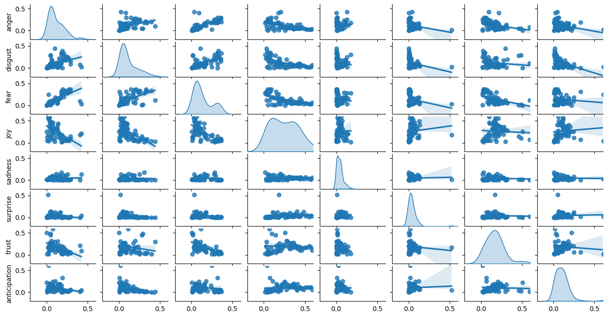

#### task 1: pre-traitement des textes
Remplacer les variantes par une seule forme.

step1: 
lire lexique ELAL, faire un dictionnaire, avec chaque variante comme key et la première variante comme valeur.
*Le dictionnaire est sauvegarde dans fichier lexicon_analyse/variante_replace.csv*

step2: (Pas un step necessaire, mais c'est pour simplifier la visualisation)
Remplacer les variantes par les formes, puis sauvegarder le nouveau texte et mots remplacés
dans deux fichiers .txt. Les fichiers sont dans le répertoire *text_brut_replaced*

step3: lire les fichiers dans treated_files, prendre les colonnes "text", faire une liste de tournes de paroles pour chaque piece, puis les tokeniser, et faire les remplacements par apports au dictionnaire, sauvegarder les fichiers dans repetoire: csv_replaced.

step4: calculer tf-idf par la liste de tournes de paroles, et sauvegarder les fiches tf-idf dans repetoire
idf_info. Puis, dans le script avgEmoValues.py, pour chaque piece, lire sa fiche tf-idf, et extraire les coeffs tf-idf des mots par tourne de paroles.
exp:
pour mots "fir", ses coeffs dans une piece :[0,0,1,2,3,0,4,5,0,0], chaque element represente une tf-idf dans une tourne de parole, alors je prends que les non-zero, ca veut dire: [1,2,3,4,5], puis, tf-idf * coeffs_lexique pour calculer les coeffs d'emotion finale.

#### comparaison

**tf-idf_phrases:** 


**tf-idf_files:**


**Sans tf-idf**


Selon les images, avec tf-idf des tournes de paroles, les donnees sont plus concentre, et la tendance est comme prevu, c'est toujours le joy qui occupe le plus grand surface, et les emotions pairs negatifs ont des correlation negatif sauf fear et anger.

#### deux problèmes trouvé
1. (fixed)
Dans les fichiers avant, j'ai mal utilisé alsace-tokenizer, 
```python
ret = at.RegExpTokeniser()
phrase = (ret.tokenise(block)).get_contents()
tokens = re.split(regex, phrase)
```
n'est pas correcte, il manque get_tokens, donc il doit être
```python
tokens = ret.tokenise(ori_text)
tokens = tokens.get_tokens() # mtn tokens c'est une liste des objets
for i in range(len(tokens)):
    print(tokens[i].get_contents()) # il fault utiliser get_contents() pour obtenir les valeurs des objets
```
2. (Pas encore fixed)
La bibliotheque qu'on utilise a coupe des paroles, avgEmoValues.py

La commande est:

```
python3 avgEmoValues.py --dataPath ../pieces_more_info/treated_files/tei-lustig/am-letzte-maskebal.out.csv --lexPath ELAL-als-lexicon.csv --lexNames valence dominance arousal anger anticipation disgust fear joy sadness surprise trust --savePath am-letzte-maskebal
```
fichier entree: pieces_more_info/treated_files/tei-lustig/am-letzte-maskebal.out.csv
tout est bon dans fichier entree

fichier sortie:
am-letzte-maskebal/anger.csv
Une parole de Domino a ete coupe

**Pourquoi?**

Quand il n'y a pas de mots dans lexique trouve, alors il coupe la parole


#### Final To do 

1. Commenter les fonctions etc.

2. Structure de depo