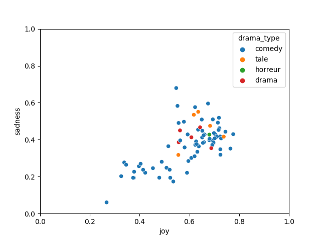
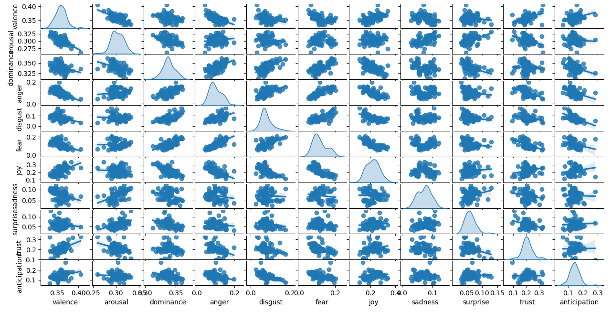

#### amelioration

1. scatterplot & rolling mean:
J'ai essayé de remplacer les moyennes d'émotions par les pourcentage.
groupe1 : Valence, Arousal, Dominence
groupe2: Anger, anticipation, ... trust

le *pourcentage* implique la portion d'une emotion dans son groupe,
calculé par:
    sum de rolling means d'une emotion / sum de rolling means de toutes les emotions dans le groupe

L'amélioration est visible, les nouveaux scatterplots ont été mis dans repetoire [graphic_scatterplot](graphics)

**par exemple:**
*joy et sadness avec moyennes*


*joy et sadness avec pourcantage*


2. split play
En modifiant *split_plays.py*, mtn dans le fichier **rolling_mean.csv** de chaque repetoire,
la colonne "progress" représente le découpage.
la colonne "Unnamed 0:" a été enlevé.

3. pair plot
```
python3 graphic.py group
```

Pour regarder le pairplot de toutes les emotions


4. most_positive / most_negative

```
python3 graphic.py most_positive
python3 graphic.py most_negative
```
La polarite est calcule selon valence, la regle de calcul:

Si valence >= moyennes de valence, alors polarite += 1
Sinon, polarite -= 1
