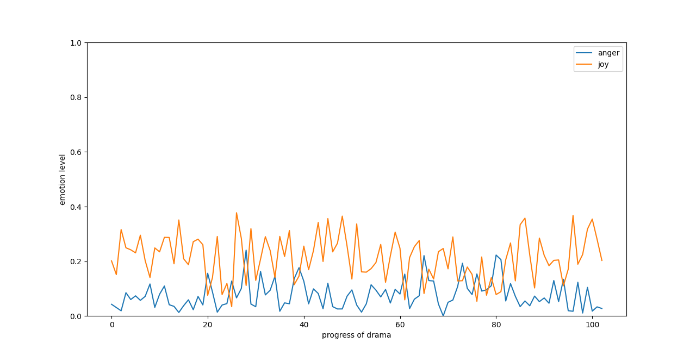
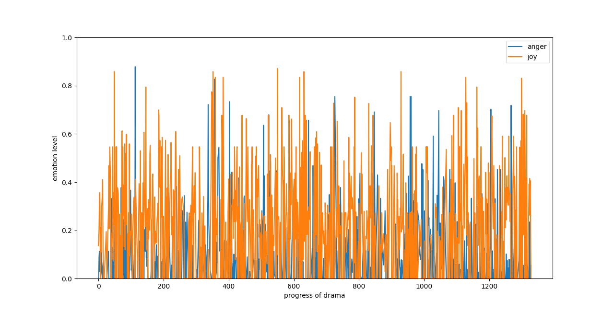
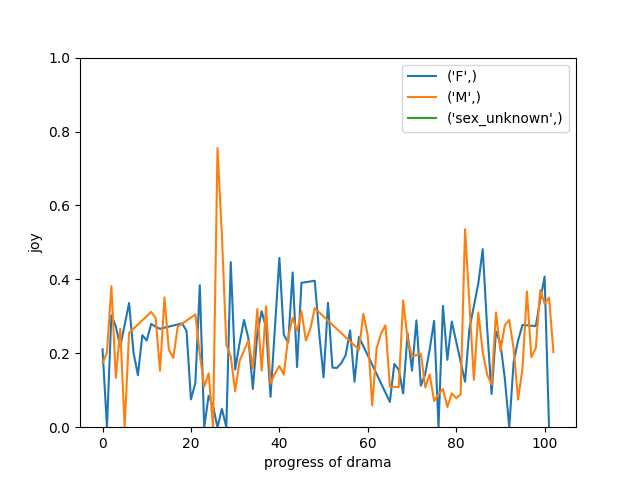

#### tasks

1. séparer la pièce par (scene or progress)
2. scatterplot (remplacer les moyennes des émotions par emo max?)
3. fréquence des mots Alsaciens parcourus

#### demonstration

``` shell
python3 graphic.py arg1 arg2 arg3 arg4
```
**arg1**: single/group (indiquer Si le plot est sur 1 seule piece ou plusieurs pieces)
**arg2**: Si arg1 == group, alors arg2 = --emotion/--shortName
      Si c'est single plot, arg2 doit etre nom du piece de theatre
**arg3**: Si arg2 == --emotion, arg3 est les emotions pour analyser, separees par ",", cela **affiche** les positions d'emotions de toutes les pieces dans un scatter plot
      Si arg2 == --shortName, arg3 doit etre nom du piece de theatre, cela **affiche** tous les coeffs des emotions dans une piece
      Si arg2 == comedy.drama/tale/horror, cela **affiche** tous les coeffs des emotions d'une type de theatre.
      Si c'est single plot, arg3 est les emotions pour analyser separe par "," cela **affiche** changement des emotions selon progress du theatre
**arg4**: Si c'est group plot, alors arg4 doit etre une type de theatre (comedy, drama, tale ou horror),
      Si c'est single plot, arg4 est un filtre, il peut etre nom de colonne dans fichiers csv dans repetoire treated_files
##### exemples

**scatter plot**
```
python3 graphic.py group --emotion anger,joy
```


```
python3 graphic.py single arnold-der-pfingstmontag anger,joy
```
**C'est la photo apres la separation par pourcentage**


**C'est la photo *SANS* la separation par pourcentage**


**Avec filtre**
```
python3 graphic.py single arnold-der-pfingstmontag anger,joy sex
```


#### Un changement de logic de calcule pour le group plot

J'ai refait le fichier *all_pieces_info.csv* en calculant pour chaque emotion la moyenne des 10 premiers coeffs les plus hauts. (par exemple, pour une piece, je cherche d'abord  10 coeffs les plus hauts d'emotion *anger*, apres, je calcule la moyenne de ces 10 coeffs et je l'ajoute dans *all_pieces_info.csv*)

C'est le fichier avant avec que la moyenne:
[all_pieces_info_moyenne.csv](../ed_analyse_pieces/all_pieces_info_moyenne.csv)

C'est le fichier avec la moyenne des 10 max coeffs, ce qui grandi les differences entre les emotions:
[all_pieces_info.csv](../ed_analyse_pieces/all_pieces_info.csv)

#### tache 3
dans le fichier [mots-als-freq.csv](../mots-als-freq.csv), il y a des frequences des mots alsaciens parcourus dans toutes les pieces de theatre.

le codes pour faire ce fichier se trouve: [als_words_freq.py](../lexicon_analyse/als_words_freq.py)